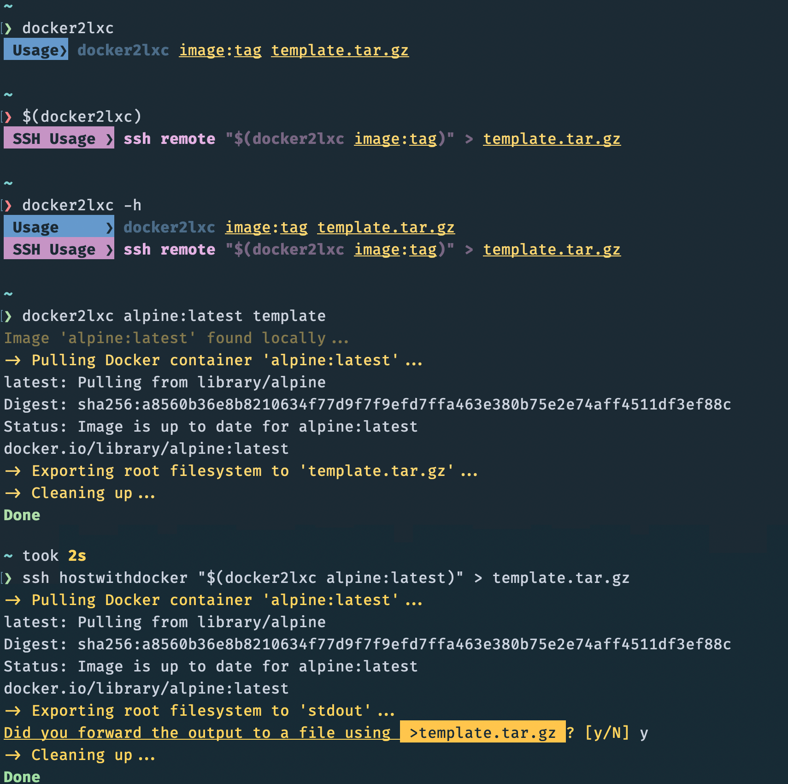

# docker2lxc

`docker2lxc` is a shell script that allows you to export a Docker image as a root-filesystem tarball, which can be used as an LXC template in Proxmox.

> [WARNING]
> This cli tool is in an early alpha stage. It is provided "as is" without warranty, and as a personal project that is in development to explore its usefulness to its creators and others in the open-source community.

## Screenshot



## Installation

```bash
mkdir -p ~/repos && cd ~/repos
git clone https://github.com/diraneyya/docker2lxc.git
sudo make install
```

If you do not have `sudo` or if you are logged in as root, just run `make install`.

## Usage

Always invoke the tool from the machine on which you need the final LXC template to reside.

We have two usage scenarios, depending on whether the aforementioned machine has Docker installed or available.

### Docker is available

In this case, use:
```bash
docker2lxc $image:$tag $tarball
```

In the same way you would use:
```
docker pull $image:$tag
```

### Docker is not available

In this case, set up an SSH access to another machine which has Docker and enough storage space, then use:
```bash
ssh $hostwithdocker $(docker2lxc $image:$tag) > $tarball
```

> [!NOTE]
> In this case, the `docker2lxc` command is transferred and invoked on the SSH remote (i.e. `$hostwithdocker`), with the tarball being saved on the machine you are working from (which, in turn, can also be a remote server that you are SSH'ing to, that is okay!).

> [!TIP]
> This usage scenario is also useful when the machine on which the LXC template needs to be stored does not have enough storage for the conversion of large Docker images.

## Questions?

If you are intrigued by this work, check out the experimental branches, which will help you understand my thought process.

For any feedback, questions, or engagements, please email me at <info@orwa.tech>.
